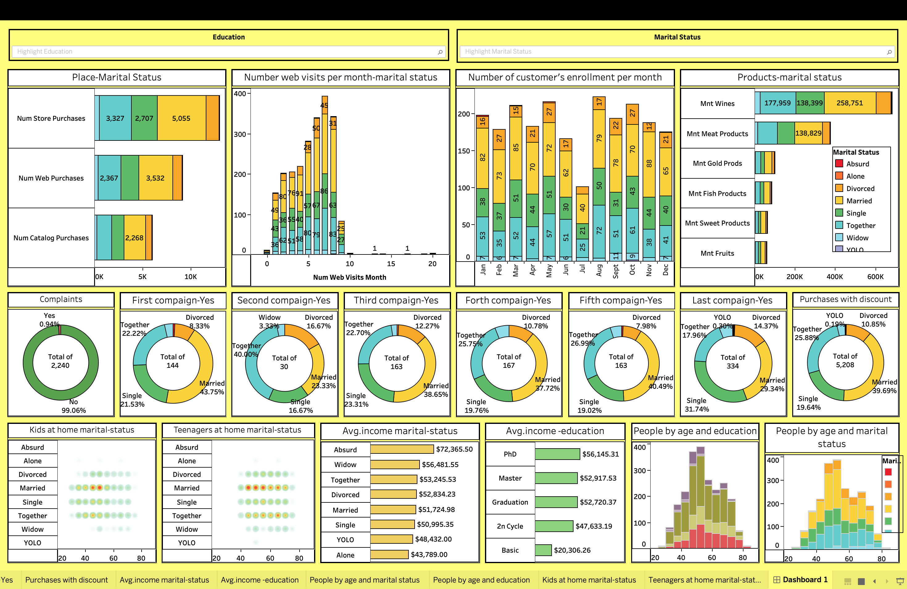

# Customer-Personality-Dashboard
Interactive Tableau Dashboard analyzing Customer Segmentation, Product Preference, and the success of 5 Marketing Campaigns to optimize future strategy.
# 📈 Marketing Campaign Analysis Dashboard

## Project Overview
This project presents an interactive Tableau dashboard for analyzing customer behavior and the effectiveness of marketing campaigns. The goal is to identify key customer segments, understand their preferences, and optimize future marketing strategies.

## Data Source
The dataset used in this project contains customer demographic information, product purchase history, and their responses to 5 different marketing campaigns. 

## Dashboard Preview
Below is a static preview of the interactive dashboard:

## Key Features
- **Customer Segmentation:** Analysis by Marital Status, Education, Income, and presence of Kids/Teenagers.
- **Campaign Performance:** Tracking the acceptance rate for 5 different marketing campaigns.
- **Product Preferences:** Identifying popular products among various customer groups.
- **Web Activity Analysis:** Understanding customer engagement through website visits.
- **Complaint and Response Tracking:** Monitoring customer satisfaction and campaign responsiveness.

## Key Insights & Recommendations

### 1. High-Value Customer Segment:
- **Insight:** Married/Together customers with higher education (PhD, Graduation) and income show the highest engagement and spending on products like Wines and Meat.
- **Recommendation:** Tailor premium product offerings and loyalty programs specifically for this segment.

### 2. Campaign Effectiveness:
- **Insight:** Campaign 1 (e.g., **44 accepts**) showed the lowest acceptance rate, while Campaign 5 (e.g., **353 accepts**) was significantly more successful. Married customers consistently show the highest acceptance across all campaigns.
- **Recommendation:** Analyze the strategy (channel, messaging, timing) of Campaign 5 to replicate its success in future campaigns. Re-evaluate or discontinue underperforming campaigns.

### 3. Optimal Customer Enrollment Periods:
- **Insight:** Customer registrations peak in **March, May, August, and October**.
- **Recommendation:** Increase marketing budget and launch targeted campaigns just before and during these peak months, aligning content with seasonal consumer behavior (e.g., Spring offers, Back-to-School, Holiday prep).

### 4. Product Preferences:
- **Insight:** Wines and Meat products are the most frequently purchased categories across all customer segments.
- **Recommendation:** Implement cross-selling strategies by pairing these popular products with complementary items.

### 5. Website Engagement:
- **Insight:** Most customers visit the website 5-7 times per month, with Married/Together groups being the most active.
- **Recommendation:** Introduce exit-intent pop-ups or personalized offers for high-frequency, low-conversion website visitors.

## How to View the Dashboard
1. Download the `Marketing_Campaign_Analysis.twbx` file from this repository.
2. Open the file using Tableau Desktop or Tableau Public.
3. Interact with the filters and parameters to explore the data.

## Technologies Used
- Tableau Desktop
- Microsoft Excel (for data preparation, if applicable)

## Contact
For any questions or feedback, please contact me at [nicatsahmarov222@gmail.com] or connect with me on [[Sizin LinkedIn Profilinizin Linki](https://www.linkedin.com/in/nicat-%C5%9Fahmarov-1208a0293/)].
